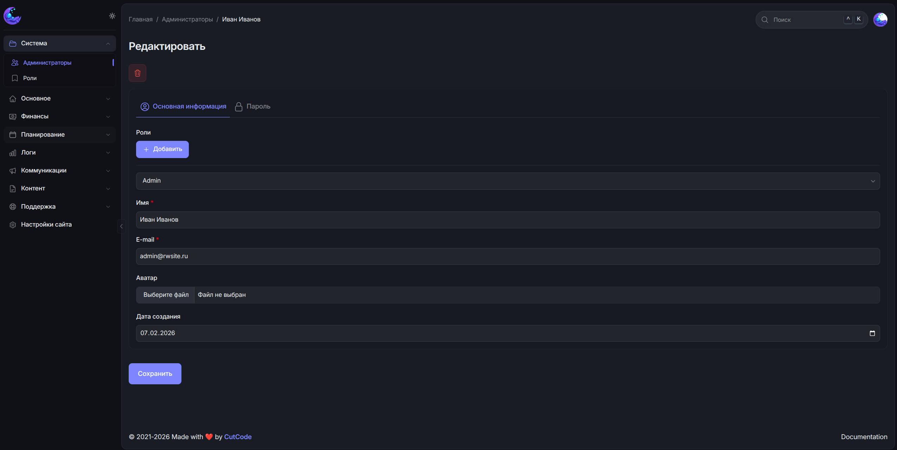
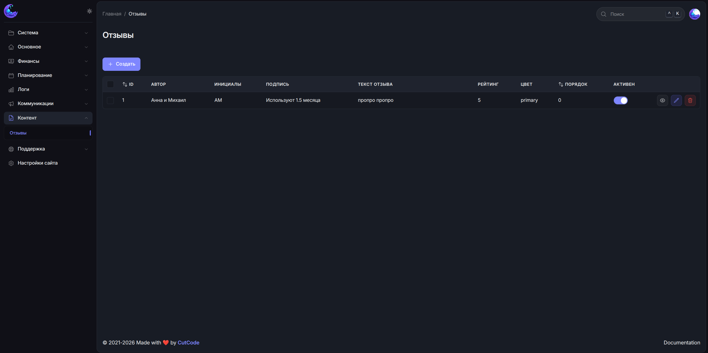

# MoonShine Polaris Theme

Reusable MoonShine v4 theme package with:

- Polaris color palette (light + dark)
- Reusable base layout without project business menu
- Custom CSS overrides for cleaner admin UI

## Preview




## Installation

```bash
composer require rwsite/moonshine-polaris-theme
php artisan vendor:publish --tag=moonshine-polaris-theme-assets
php artisan vendor:publish --tag=moonshine-polaris-theme-config
```

## Usage

### 1) Set MoonShine layout and palette in `config/moonshine.php`

```php
use Rwsite\MoonShinePolarisTheme\Layouts\PolarisThemeLayout;
use Rwsite\MoonShinePolarisTheme\Palettes\PolarisPalette;

return [
    // ...
    'layout' => PolarisThemeLayout::class,
    'palette' => PolarisPalette::class,
];
```

### 2) If you need a custom menu, extend package layout

```php
<?php

declare(strict_types=1);

namespace App\MoonShine\Layouts;

use Rwsite\MoonShinePolarisTheme\Layouts\PolarisThemeLayout;

final class AppMoonShineLayout extends PolarisThemeLayout
{
    protected function menu(): array
    {
        return [
            ...parent::menu(),
            // Your project menu here
        ];
    }
}
```

Then set:

```php
'layout' => App\MoonShine\Layouts\AppMoonShineLayout::class,
```

## Publish assets manually

```bash
php artisan vendor:publish --tag=moonshine-polaris-theme-assets --force
```

## Release

```bash
git tag v1.0.0
git push origin v1.0.0
```

## License

MIT
